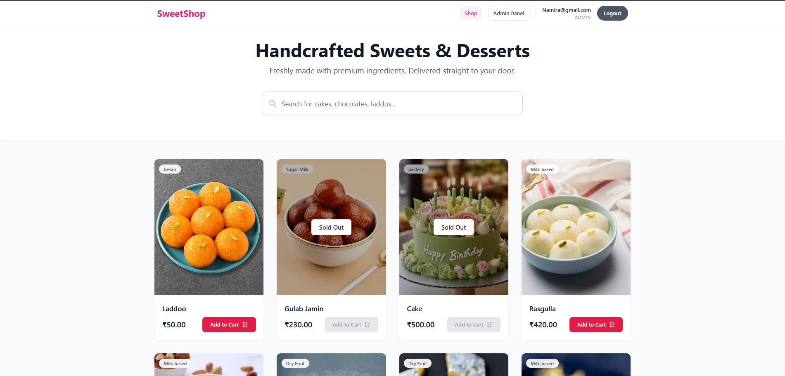
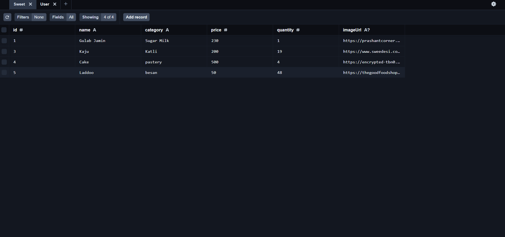

### **2. Frontend Repository README**
**File:** `sweet-shop-frontend/README.md`

# 🍬 Sweet Shop UI (Frontend)

A modern Single Page Application (SPA) for the Sweet Shop. Built with **Angular 19**, **RxJS**, and **Tailwind CSS**.

**Backend Repository:** [Link to your Backend Repo]

## 🚀 Features
* **Browse & Search:** Real-time filtering by Name, Category, and Price using RxJS operators.
* **User Accounts:** Secure Registration and Login forms.
* **Shopping:** "Purchase" button that automatically decrements stock in the database.
* **Admin Dashboard:** A specialized interface for Inventory Management (Add, Update, Delete, Restock).

---

## ⚙️ Setup Instructions

### 1. Install Dependencies
Navigate to the project folder:

npm install
2. Start the Application
Run the Angular development server:

Bash

ng serve
Navigate to http://localhost:4200 in your browser.

3. Admin Access
Login: Use the credentials created in the backend (Role: ADMIN).

Dashboard: Once logged in as an Admin, access the /admin route to manage inventory.

## 📸 Screenshots

### 1. Dashboard (Search & Filter)

### 2. Admin Inventory Management

### 3. Login Page

### 5. Admin Database View (Prisma Studio)

🤖 My AI Usage
In compliance with the project requirements, I utilized AI tools to assist in the development of this application.

Tools Used:

Google Gemini: Used as a primary co-pilot for code generation, debugging, and architectural planning.

How I Used It:

Boilerplate Generation: Generated initial structures for Angular components (Login, Dashboard) to speed up UI development.

Reactive Forms: Assisted in building the complex Filter Form (FormGroup) that combines multiple inputs (Name, Category, Price) into a single reactive stream using switchMap and debounceTime.

Debugging: Helped resolve RxJS observable issues where the filter logic was not triggering correctly.

Reflection: Using AI allowed me to implement advanced Reactive patterns quickly. It was particularly helpful in connecting the Frontend filters to the Backend query parameters seamlessly.
